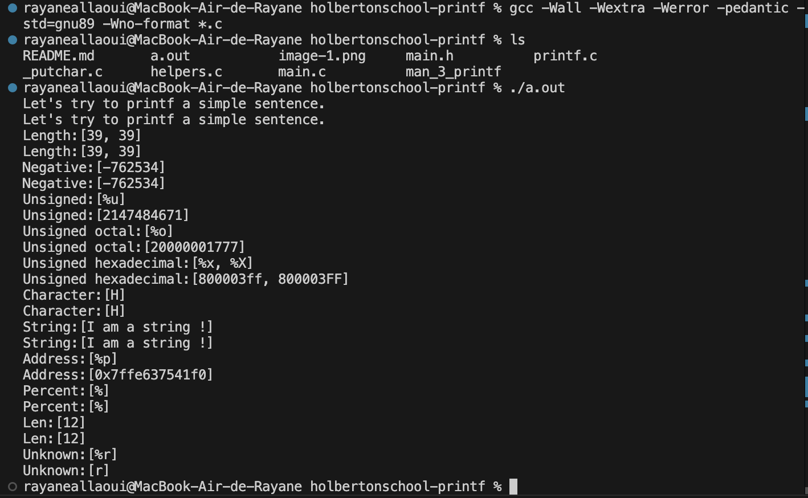
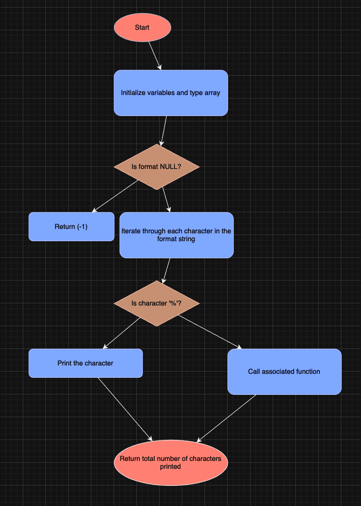

# Custom Printf Function

## Description

This project implements a custom `_printf` function that mimics the behavior of the standard C library `printf` function. It provides a way to print formatted output to the standard output stream.

## Features

The `_printf` function supports the following format specifiers:

- `%c`: Prints a single character
- `%s`: Prints a string
- `%d`: Prints a decimal integer
- `%i`: Prints an integer
- `%%`: Prints a percent symbol

## Man page
The commande for execute man page : man./man_3_printf

## Usage

To use the `_printf` function in your C program:

1. Include the header file:
   ```c
   #include "main.h"

Call the function with a format string and optional arguments:
c
int count = _printf("Hello, %s! The answer is %d.\n", "world", 42);

Function Prototype
c
int _printf(const char *format, ...);

format: A string that contains the text to be written to stdout. It can optionally contain embedded format specifiers that are replaced by the values specified in subsequent additional arguments.
...: Additional arguments replacing the format specifiers in the format string.
Return Value
The function returns the total number of characters printed (excluding the null byte used to end output to strings). If an output error is encountered, a negative value is returned.
## Exemples and Testing 

## Flowcharts


Authors
[Rayane Allaoui and Ardonit Musliu]
License
This project is open source and available under the MIT License.